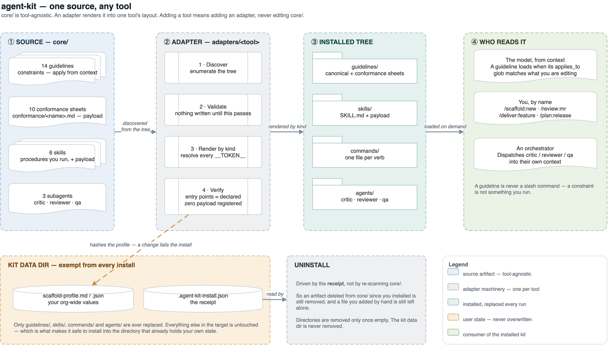

# agent-kit

Guidelines, skills and subagents for AI coding tools, kept in one place and installed into
whichever tool you use.

`core/` is tool-agnostic — it contains no tool's paths, filenames or invocation syntax, and no
client's name. Everything tool-shaped lives in `adapters/<tool>/`. Adding a tool means adding an
adapter, never editing `core/`.

```
./install.sh                 # install into ~/.claude
./install.sh --list          # which adapters exist
./install.sh --dry-run       # validate and report; write nothing
```



---
📖 **[docs/COMMANDS.md](docs/COMMANDS.md) — what every command prints.** Real captured output
for install, scaffold, add, configure and uninstall, with what each line means. Start there if
you are setting up: it opens with the profile and config sheet, which you want in place before
you scaffold anything.

---

## What's in it

**14 guidelines** — constraints that apply from context, never invoked.

| | |
|---|---|
| language / framework | `python` `python-llm` `java` `react` `streamlit` `chainlit` |
| repo type | `api` `chat-api` `pipeline` `job` `agent` `genie` |
| practice | `design` `service-structure` |

Ten of them ship an audit list at `conformance/<name>.md` — split out so whoever is
*writing* code loads the rules and whoever is *auditing* loads the checklist. A count is
the thing that goes stale here, so derive it: `ls core/guidelines/conformance/`. See
[`STANDARD.md`](STANDARD.md) §1.2 for why it is a subdirectory and not a
`<name>.conformance.md` sibling.

**6 skills** — procedures you deliberately run, each with scripts behind it.

| | |
|---|---|
| `/plan:release` | a release plan through nine ordered gates, scheduled and validated |
| `/deliver:spec` `:feature` | one requirement through nine gates — spec first (approved document by document), then reviewed, tested code and a report |
| `/diagram:build` `/diagram:review` | draw.io diagrams, verified by rendering and reading them before they are shown |
| `/scaffold:new` `:add` `:configure` `:profile` | Databricks repos by type, and their config |
| `/review:mr` | a pushed change reviewed against the standards its changed files trigger |
| `/eval:new` | an evaluation spec in the repo that owns it |

**3 subagents** — independent workers with their own context.

| | |
|---|---|
| `critic` | reads a *requirement* and reports what is missing from it |
| `reviewer` | reads a *diff* and reports what is wrong with it |
| `qa` | reads a *diff* and writes the tests for it |

Each earns its round trip on independence, context economy, or both — see
[`STANDARD.md`](STANDARD.md) §1.1. None should grow into another's job.

---

## The three kinds, and how to choose

This is the only design decision that matters when adding something. Full rules in
[`STANDARD.md`](STANDARD.md) §1.1.

| Kind | It is | Lives in |
|---|---|---|
| **guideline** | a *constraint* — how a thing is done whenever you do it | `core/guidelines/<name>.md` |
| **skill** | a *procedure* — deliberately run, produces an artifact | `core/skills/<name>/` |
| **subagent** | an *independent worker* — own context, returns a verdict | `core/subagents/<name>.md` |

**Default to guideline. Promote to skill only if it is a procedure. Promote to subagent only
if** it reads a lot and reports a little, **or** must not see the reasoning that produced the
thing it examines, **or** runs in parallel with siblings.

A subagent costs a round trip and returns a summary instead of the reasoning. Paying that for
something that could have been text in your current context is pure loss.

---

## Adding a skill

```
core/skills/<name>/
  SKILL.md            REQUIRED  frontmatter + body; the model-invoked entry point
  commands/<verb>.md  optional  user-invoked entry points → /<name>:<verb>
  README.md           optional  documentation for maintainers; never installed
  reference/**        payload   long-form material the skill reads
  templates/**        payload   files the skill copies or renders
  *.py                payload   scripts the skill runs
```

1. Write `SKILL.md` with `name`, `kind`, and a `description` that says **when to reach for it**.
   The description is the only signal a model has when choosing between artifacts.
2. **Only `SKILL.md` and `commands/*.md` are registered.** Everything else is payload. If you
   are unsure whether a file is an entry point, it is not.
3. Address your own files with `__SKILL_DIR__`, shared user state with `__KIT_DATA_DIR__`, and
   other commands with `{{cmd:<skill>:<verb>}}`. Never a hardcoded path, a `~`-relative path, or
   one tool's slash syntax.
4. Run the installer. Its verify step will tell you what you got wrong — an unresolvable
   `{{cmd:…}}` or invalid frontmatter fails the install before anything is written.

---

## Adding an adapter

An adapter installs `core/` into one tool. It owns paths, file formats, registration mechanics,
hooks and settings — everything tool-shaped.

1. Read [`STANDARD.md`](STANDARD.md) Part 2. It lists eleven obligations and the conformance
   checklist you will be held to.
2. Copy the shape of [`adapters/claude/install.py`](adapters/claude/install.py) — the reference
   implementation. Every obligation is annotated there.
3. **You may support a subset.** If your tool has no native form for a kind, render what you can
   and *log by name* what you skipped. Silently dropping a kind is a contract violation. This
   clause is what lets a new adapter ship without changing `core/`.
4. Resolve the markers: `__SKILL_DIR__`, `__KIT_DATA_DIR__`, `__GUIDELINES_DIR__`, `{{cmd:…}}`,
   `{{args}}`. A surviving marker is a failed install, not a warning.
5. Provide a kit data dir and **never overwrite it** — user-filled state lives there precisely
   because skill directories are replaced wholesale on every install.
6. **Write its conformance run in the same pass.** An adapter without one looks finished and
   is not — the reference adapter passed 11 of 13 checks while missing uninstall entirely.
   `adapters/claude/conformance.sh` is written against `STANDARD.md` rather than against
   Claude, so most of it should run unchanged against a second adapter. See §2.5.

Claude is the only adapter today. That is a deliberate stopping point, not an omission: the
contract, the `--target` seam and this section all exist, so a second tool is an addition
rather than a refactor.

---

## Layout

```
core/            tool-agnostic — the actual content
  guidelines/    the constraints, plus conformance/ — the audit list beside each
  skills/        deliver · diagram · eval · plan · review · scaffold
  subagents/     critic · reviewer · qa
adapters/
  claude/        install.py · hooks/ · workflows/ — the reference implementation
docs/            COMMANDS.md — real captured output for every command
STANDARD.md      the artifact format, and the adapter contract
install.sh       dispatcher: --target <tool>
```

**A scaffolded repo does not get a copy of the guidelines.** They are read from the
installed tree, so one edit here is the rule in every repo at once. Copying them per repo
was tried and measured: six repos built from one scaffold carried six different subsets,
every copy drifted from source, and nothing read them. See
[`core/skills/scaffold/README.md`](core/skills/scaffold/README.md).

Edit the repo and re-run the installer. Anything hand-edited inside an installed copy is
replaced on the next install.
