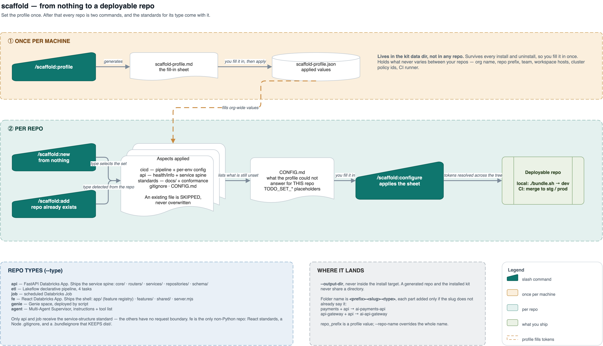

# scaffold

A four-command skill for standing up **Databricks repos** — and
keeping their config out of your way. You scaffold a repo of one type, and every
machine- and repo-specific value is either baked in from a shared profile or left as a
`TODO_SET_*` placeholder you fill in one pass later.



Source: [`docs/scaffold-flow.drawio`](docs/scaffold-flow.drawio). It lives here rather than
in the repo's top-level `docs/` so it cannot drift from the skill it describes — and, being
documentation rather than payload, it is never installed (STANDARD.md §1.3). Edit the
`.drawio` and re-render the PNG; a stale diagram is worse than none.

| Command | What it does | Direction |
|---|---|---|
| [`{{cmd:scaffold:profile}}`](commands/profile.md) | Set up the org/project values shared by every repo (branding, team, CI/CD, cluster policies) — once per scope. | `scaffold-profile.md` |
| [`{{cmd:scaffold:new}}`](commands/new.md) | Scaffold a new repo (type-driven wizard: `api` · `etl` · `job` · `agent` · `genie`). | templates → new repo |
| [`{{cmd:scaffold:add}}`](commands/add.md) | Add **one aspect** — the `cicd` deploy pipeline or the `api` surface — to a repo that already exists. | templates → existing repo |
| [`{{cmd:scaffold:configure}}`](commands/configure.md) | Fill the per-repo `TODO_SET_*` placeholders a scaffolded repo ships with. | `CONFIG.md` → repo |

## The two-level config model

The whole design exists to answer one question for every setting: *is this the same for
every repo my team makes, or genuinely specific to this one?*

- **Profile** (`{{cmd:scaffold:profile}}`) — the constants: org/branding, workspace project
  folder, team & ownership, CI/CD controller, cluster policies. Collected **once** and
  baked into every repo you scaffold thereafter.
- **`CONFIG.md`** (`{{cmd:scaffold:configure}}`) — the per-repo values: workspace hosts, service
  principals, repo URL, catalog, table prefix. Each scaffolded repo ships a one-page
  `CONFIG.md` listing exactly the placeholders it still contains.

Anything you leave blank in the profile simply stays a per-repo `TODO_SET_*` placeholder,
so the split is a soft default, not a hard boundary.

## Typical flow

```
# once per scope — the machine, or one client's tree
{{cmd:scaffold:profile}}                      # creates + reports it; add --scope project
edit <the file it reports>                    # fill shared values — no apply step

# per use case
{{cmd:scaffold:new}}                          # interactive wizard → creates the repo
edit <repo>/CONFIG.md                  # fill the per-repo placeholders
{{cmd:scaffold:configure}}                    # apply them across the repo tree

# for a repo that already exists (including one this tool never made)
{{cmd:scaffold:add}}                          # pick an aspect → cicd (deploy pipeline) or api
{{cmd:scaffold:configure}}                    # apply the placeholders the new files brought in
```

## Repo types

`{{cmd:scaffold:new}}` produces one repo of a **single type**, chosen by *what the repo produces*,
not the tech inside it:

| Type | Primary resource | Deploy | CI/CD |
|---|---|---|---|
| `api` | `resources.apps` — FastAPI Databricks App | `bundle deploy` | enterprise controller |
| `etl` | `resources.pipelines` — Lakeflow declarative pipeline | `bundle deploy` | enterprise controller |
| `job` | `resources.jobs` — scheduled Databricks Job | `bundle deploy` | enterprise controller |
| `agent` | Agent Bricks Multi-Agent Supervisor | `supervisor_agents` SDK (`./deploy.sh`) | validate → deploy |
| `genie` | Genie space | Genie management API (`./deploy.sh`) | validate → apply DDL → deploy |

`agent` and `genie` have no DAB bundle — `src/deploy.py` calls a management API instead, and
neither repo stores an id: the resource is resolved by name, `"<display_name|title> [ENV]"`,
in the target workspace.

The one ambiguous pair is `etl` vs `job`. The sharp test: **does the repo materialize a
graph of Delta tables via declarative transforms? Yes → `etl`. No — it performs an *action*
(export, orchestrate, score, maintain, trigger) → `job`.** See [new.md](commands/new.md) for the
full decision table.

## Aspects — the same pieces, à la carte

A repo is not monolithic: it is a type skeleton plus a few **aspects**. Each aspect is one
named slice, defined once in [`aspects.py`](aspects.py) and applied through one function, so
*"the cicd aspect"* means the identical set of files whether it lands in a brand-new repo or a
five-year-old one. Two are choosable:

| Aspect | Adds | Types |
|---|---|---|
| `cicd` | `.gitlab-ci.yml` + `team_config.yaml` + `run_resources.yml` + `.bundleignore` (genie: its space-validating pipeline); on a `job` repo also `config/{DEV,STG,PROD}/task_config.yaml` | `api` `etl` `job` `genie` |
| `api` | `routers/platform.py` (`GET /v1/health` + `GET /v1/info`) plus the service spine those endpoints need: `core/` (validated settings, one logging setup, one exception hierarchy behind one handler layer, request-id middleware), `schema/`, `services/`, `repositories/` | `api` |

The rest are **not decisions**, so they are never offered: the standards docs for the repo's
type (each with its `*_CONFORMANCE.md` sheet), `.gitignore`, `docs/specs/README.md`, and a
regenerated `CONFIG.md` come with **any** add wherever they are missing. They live in the same
registry — one definition each — just flagged `selectable: False`, and `add --list` prints
them straight from `AUTO` so the list cannot drift from what a run actually applies.

`docs/specs/` is seeded with a README and nothing else. A convention needs somewhere to land
before the first feature or the first spec gets written wherever that run happened to guess —
but a placeholder example folder is the kind of thing people copy rather than replace, so
there isn't one. {{cmd:deliver:spec}} and {{cmd:deliver:feature}} create the per-feature
folders.

The standards ship with `add`, not only with `new`, because the code an aspect delivers
*cites* them: the `api` aspect alone writes ten references to `docs/API_STANDARDS.md` and
`docs/SERVICE_STRUCTURE_STANDARDS.md`. Without them you get a repo with no `docs/` and ten
pointers into nothing.

Per-environment config is deliberately *inside* `cicd` rather than beside it: the DEV/STG/PROD
split exists because the controller deploys per target, so it is part of the deploy story, not
a separate thing to choose. Only `job` reads it (`${var.config_dir}/task_config.yaml`) — `api`
serves env from `app.yml` and `etl` bakes the catalog into its tasks.

`{{cmd:scaffold:new}}` applies each type's **standard set** (`DEFAULT_BY_TYPE`); `{{cmd:scaffold:add}}`
applies a single aspect to an existing repo, and `--aspect all` restores exactly that standard
set. An aspect valid for a type but outside its standard set (`api` in an already-scaffolded
api repo) stays opt-in by name.

Adding an aspect is **one entry in `ASPECTS`** — both commands pick it up, and
`add.py --detect` reports its status against any repo with no further wiring.

### Writing into a repo you did not create

`{{cmd:scaffold:add}}` is the only command that touches an existing repo, so it is deliberately
narrow: it writes **only the files the chosen aspect owns** (no tree-wide token substitution),
it **skips and reports** any file that already exists (`--force` replaces it and keeps a
`.bak`), `--dry-run` writes nothing, and `--detect` tells you the repo's type, its bundle
identity, and what is missing before anything is written. Steps a file copy cannot perform —
editing the repo's own `databricks.yml` or `app.py` — are printed as **manual wiring** rather
than left implied.

## Files

```
scaffold/
  SKILL.md                           model-invoked entry point
  commands/                          user-invoked entry points, one per verb
    profile.md  new.md  add.md  configure.md
  profile.py  new.py  add.py  configure.py    the script behind each verb
  aspects.py                         aspect registry (files / types / wiring) + repo-type detection
  config_tokens.py                   TODO_SET_* token registry (group / label / example)
  templates/                         PAYLOAD — one dir per type
    api-skeleton/  etl-bundle/  job-bundle/  agent/  genie/
    cicd/  common/                   shared CI/CD + gitignore fragments
  README.md                          DOCUMENTATION — this file. Never installed
  docs/                              DOCUMENTATION — the workflow diagram. Never installed
```

The standards a scaffolded repo receives are **not** copied into `templates/`: they are read
straight from `core/guidelines/` at scaffold time, so there is one source of truth rather
than a second copy drifting from the first.

Every file a scaffolded repo ships with lives under `templates/` as a **real file** with
`TPLVAR_*` / `TODO_SET_*` tokens — the Python is pure orchestration. `new.py` scaffolds
every type through one path (`copytree(templates/<type>/)` + token substitution) driven by
a small table, so **adding a type is a new `templates/<type>/` dir plus one row in the map.**

## How a token gets resolved

At scaffold time each token is resolved in order, and the first match wins:

1. an explicit `new.py` CLI arg,
2. the **profile** (`scaffold-profile.md`, org-wide values) — the project's own if the
   working directory sits under one, else the install-wide one,
3. otherwise a `TODO_SET_*` placeholder left for `{{cmd:scaffold:configure}}`.

To extend the system:

- **New profile field** → add a row to `FIELDS` in `profile.py`, then map its key to a
  template token in `new.py` (`_PROFILE_TODO_TOKENS`, or a `TPLVAR_` assignment for inline
  tokens).
- **New per-repo placeholder** → register it in `config_tokens.py` (token → group, label,
  example) so it groups correctly in generated `CONFIG.md` sheets. Unregistered tokens still
  appear under an "Other" group, so nothing is silently missed.
- **New aspect** → one entry in `ASPECTS` in `aspects.py` (files/dirs it owns, which types it
  applies to, `selectable`, any manual wiring), plus its key in `ORDER` and — if new repos
  should get it — in `DEFAULT_BY_TYPE`. `{{cmd:scaffold:new}}`, `{{cmd:scaffold:add}}` and `add.py --detect`
  all pick it up with no further changes. Keep the choosable set small: anything a user should
  never have to think about belongs in `AUTO` or in a type's skeleton, not in a picker.

## Where repos land

`{{cmd:scaffold:new}}` creates the repo in **`$SCAFFOLD_OUTPUT_DIR`**, the profile's `output_dir`,
or the current directory if both are unset (override per-run with `--output-dir`):

```bash
export SCAFFOLD_OUTPUT_DIR="$HOME/repos"     # or set output_dir in the profile sheet
```

Resolution order: `--output-dir` > `$SCAFFOLD_OUTPUT_DIR` > profile `output_dir` > CWD.
The repo is created at `<output-dir>/<repo-name>/` (default `ai-<slug>-<type>`).

---

See the top-level [README](../../../README.md) for install instructions, and each command's own
`.md` for the detailed flow.
